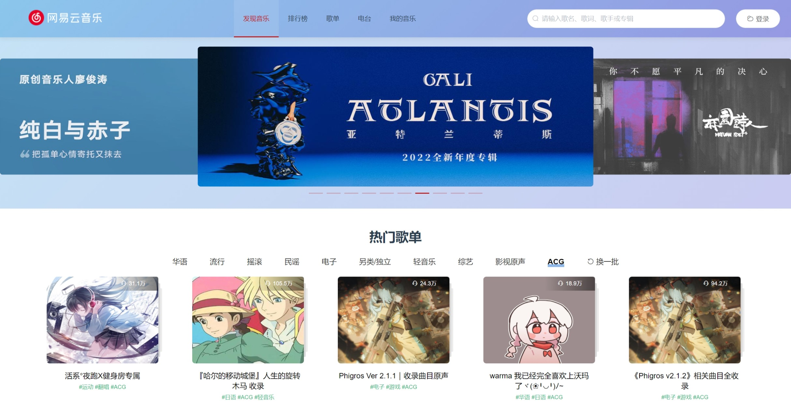
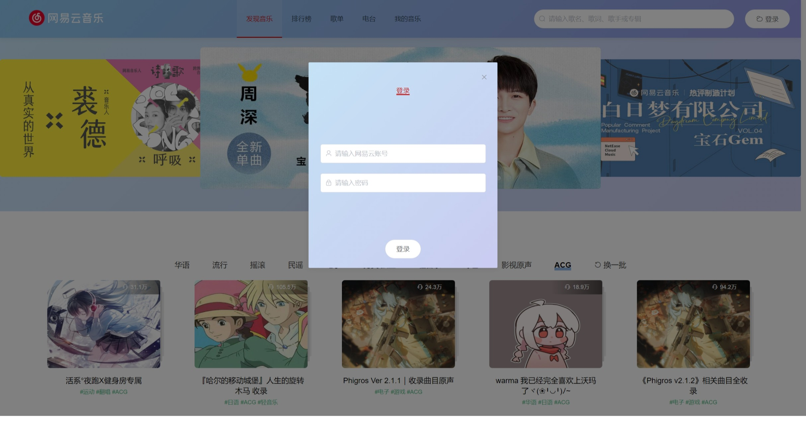
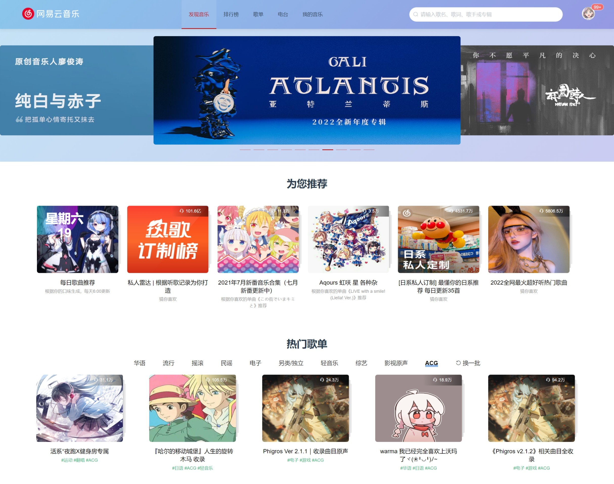
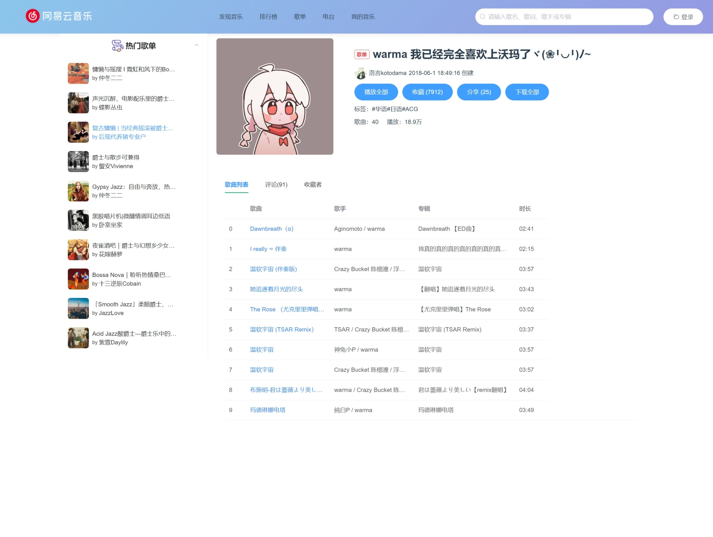
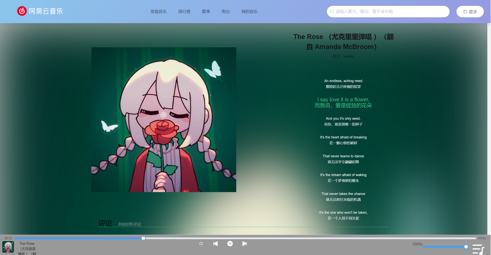
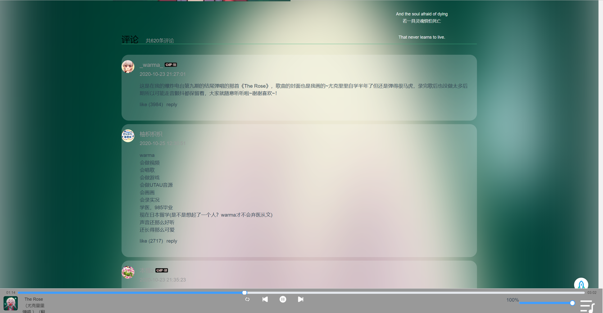

# Vue PC 端云音乐项目

### 1. 项目介绍
LiliYao-NeteaseMusic（未完成版）

如果对各位朋友有用的话, 希望可以给个star⭐

#### 技术栈
- 使用 Vue 框架进行开发
- 使用 axios 进行网络请求
- CSS 使用 FLEX 进行布局
- 项目组件库使用 ElementUI

#### 项目使用库
- ElementUI
- Vuex

#### 项目目标
- 使用 Vue 框架开发 PC 端云音乐项目

### 2. 页面效果和功能展示

- 项目首页

1. 首页轮播图 / 热门歌单

- 登录页面

- 歌单详情页面

- 歌曲播放页面

1. 实现进度条切换 / 音量切换 / 歌曲切换等功能

2. 歌曲评论

### 3. 项目源码与 API 接口
- 项目 Github 地址：https://github.com/YangZheng0620/LiliYao-NeteaseMusic
- 项目 Gitee 地址：https://gitee.com/YangZheng0620/lili-yao-netease-music
- API 接口：https://binaryify.github.io/NeteaseCloudMusicApi/#/

### 4. 项目说明

1.  这次 Vue 的项目是属于练手的一个项目，因为之前已经完成了微信小程序的开发，所以这次的逻辑是差不多的，但是 Vue 实现的细节是有所不同的，现在还是未开发完成的版本
2.  本项目暂时完成了歌单详情，歌曲播放，登录这三个板块
3.  本项目完全开源，仅供学习使用。如果对您的学习有所帮助，希望可以给个star⭐

### 5. 致谢
- 非常感谢后台提供者Binaryify，接口很稳定，文档很完善，收获很多
